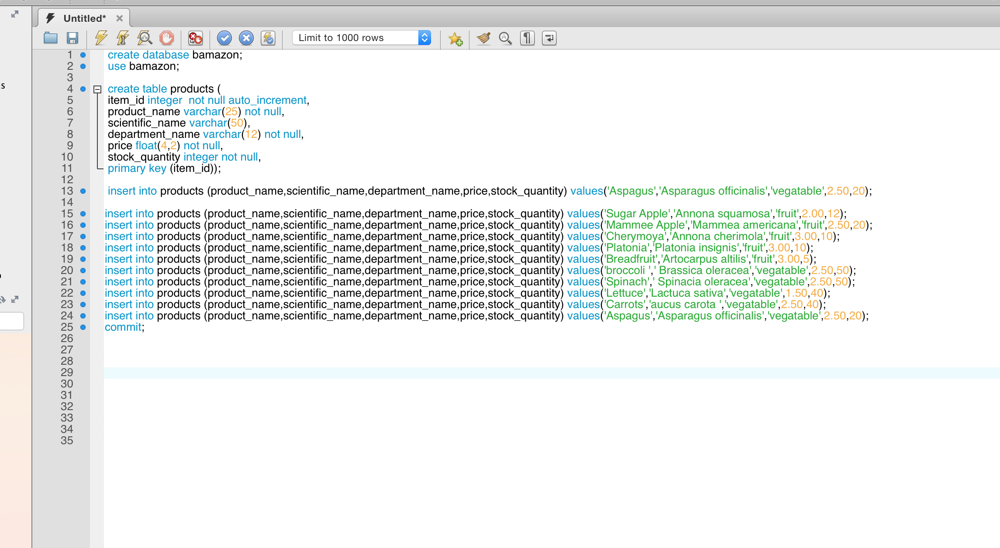

#bamazon Documentation

##mysql setup
### These scripts are run before development started to initialize the database. They are located in the sql directory.

##QuickTime movie demo of bamazon.js
### The first video will show a successful run. The id is valid and the quantity to purchase is availabe.